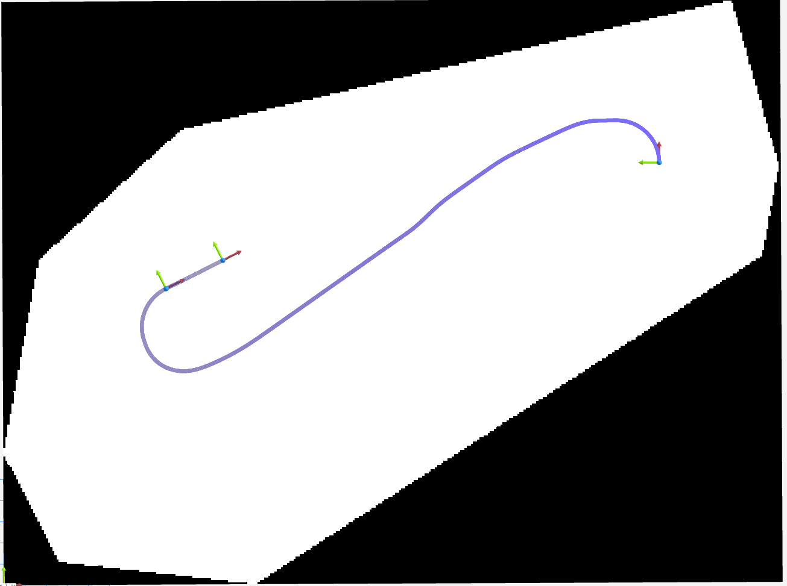
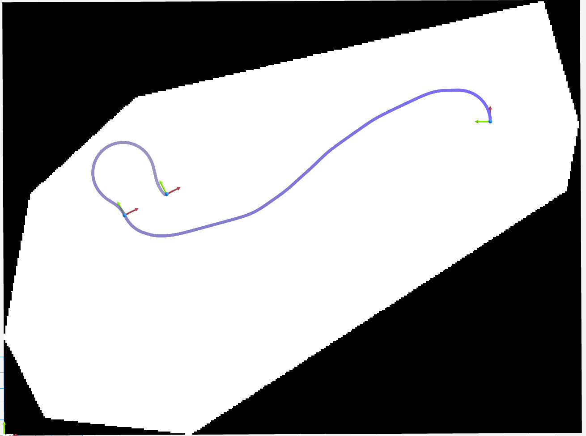

# `nav2` `planner_plugins` list order bug

https://github.com/ros-navigation/navigation2/issues/5550

## Overview

This repo presents a minimal test case for exercising a bug I have found in the nav2 `planner_server`'s ingestion of ROS parameters
during configuration of the Smac Hybrid A* planner.

## The bug

The order in which `planner_plugins` elements are listed changes the planning result from a `ComputePathThroughPoses` call.

Given these two plugin specifications:

```
    GridBased1:
      plugin: "nav2_smac_planner::SmacPlannerHybrid"
      minimum_turning_radius: 2.0

    GridBased2:
      plugin: "nav2_smac_planner::SmacPlannerHybrid"
      minimum_turning_radius: 0.02
```

If one attempts to use the `"GridBased1"` plugin ID in a `ComputePathThroughPoses` action, the resulting path will differ based on the order in which `GridBased1` and `GridBased2` are
listed in the `planner_server` `planner_plugins` ROS param. In fact, the one I have marked as "Good" below matches the expected resultant path, whereas the one that I have marked as "Bad" passes through
the position of the intermediate pose but with an orientation that is rotated 90 degrees CCW:

```
    # Bad
    planner_plugins: ["GridBased1", "GridBased2"]

    # Good
    planner_plugins: ["GridBased2", "GridBased1"]
```


## Visual Comparison

Below are visualizations of the planned path for the same start, intermediate, and end poses, using the same planner plugin ID (`GridBased1`), but with different orders in the `planner_plugins` list.

**Good (`planner_plugins: ["GridBased2", "GridBased1"]`):**



**Bad (`planner_plugins: ["GridBased1", "GridBased2"]`):**



As shown above, the "Good" configuration produces a path that correctly passes through the intermediate pose with the expected orientation, while the "Bad" configuration results in a path that passes through the intermediate position but with an incorrect orientation (rotated 90 degrees CCW).

This demonstrates that the order of plugins in the `planner_plugins` parameter list affects the planning result, even when the same plugin and parameters are used for the requested planner ID.

## Reproduction Steps

1. Clone this repo
2. Make the docker image: `make build-docker`
3. Enter the docker image with `make shell`
4. Build the example: `make build`
5. Run the good plan example: `nav2_bug_repro_pkg demo.launch.py mode:=good`
6. Run the bad plan example: `nav2_bug_repro_pkg demo.launch.py mode:=bad`

For visualization, I used Foxglove; I have provided foxglove_bridge in my minimal example for that purpose, and the `make shell` target will forward ports accordingly. I publish `/map`, `/plan`, and `/goal_poses` for visualization.

I have provided a `/trigger_path_request` service that will trigger the `ComputePathThroughPoses` call.

You can see my good versus bad param config files [here](https://github.com/acarrillo/minimal-nav2-params-bug/tree/main/nav2_bug_repro_pkg/config), and my script for calling `ComputePathThroughPoses` [here](https://github.com/acarrillo/minimal-nav2-params-bug/blob/main/nav2_bug_repro_pkg/scripts/path_request_node.py).
